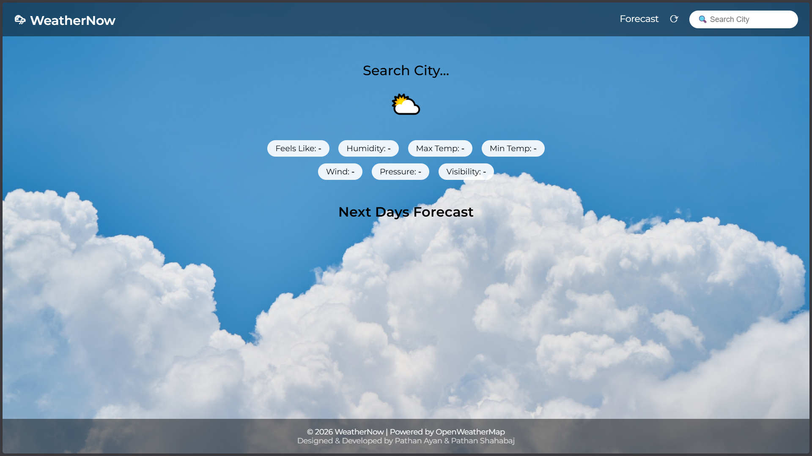
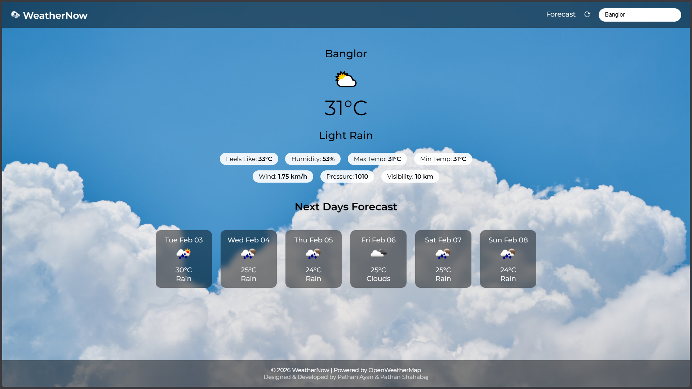

# 🌦 WeatherNow – Weather Forecast Web App

WeatherNow is a modern, user-friendly **weather forecasting web application** built using **HTML, CSS, and Vanilla JavaScript**.
It uses the **OpenWeatherMap API** to fetch real-time weather data and multi-day forecasts for any city in the world.

The app is designed with a **clean UI, responsive layout, and smooth user experience**, making it suitable for **college projects, learning purposes, and portfolios**.

---

## 🚀 Features

* 🔍 Search weather by city name
* 🌡 Displays current temperature (°C)
* 🌤 Weather condition (Clear Sky, Light Rain, etc.)
* 🤒 Feels Like temperature
* 💧 Humidity level
* 📈 Maximum & Minimum temperature
* 🌬 Wind speed
* 🌫 Visibility
* 🌡 Atmospheric pressure
* 📅 Next days weather forecast
* 📱 Fully responsive (Desktop & Mobile)
* 🎨 Clean, catchy UI with background images
* ⚡ Fast and lightweight (Vanilla JavaScript)

---

## 🛠️ Technologies Used

* **HTML5** – Structure
* **CSS3** – Styling & Responsiveness
* **JavaScript (Vanilla JS)** – Logic & API handling
* **OpenWeatherMap API** – Weather data source

---

## 📂 Project Structure

```
weather-now/
│
├── index.html
├── README.md
│
├── styles/
│   └── style.css
│
├── scripts/
│   ├── script.js
│   └── mobile.js
│
├── icons/
│   └── (weather icons, favicon)
│
└── media/
    └── (background images)
```

---

## ⚙️ Configuration (API Key Setup)

To run this project, you need an **OpenWeatherMap API key**.

### Steps:

1. Visit 👉 https://openweathermap.org/
2. Sign up or log in.
3. Go to **Profile → API Keys**
4. Generate a new API key.
5. Open `scripts/script.js`
6. Replace the API key value:

```js
const apiKey = "YOUR_API_KEY_HERE";
```

---

## ▶️ How to Run the Project

1. Download or clone the repository
2. Open the project folder
3. Open `index.html` in your browser
4. Enter a city name and press **Enter**
5. View real-time weather and forecast 🌤

*No server or build tools required.*

---

## 📸 Screenshots






---

## 👨‍💻 Designed & Developed By

* **Pathan Ayan**
* **Pathan Shahabaj**

---

## 📄 License

This project is for **educational and learning purposes**.
You are free to use and modify it for personal or academic use.

---

## ⭐ Acknowledgements

* OpenWeatherMap API
* Icons & background images used only for educational purposes
